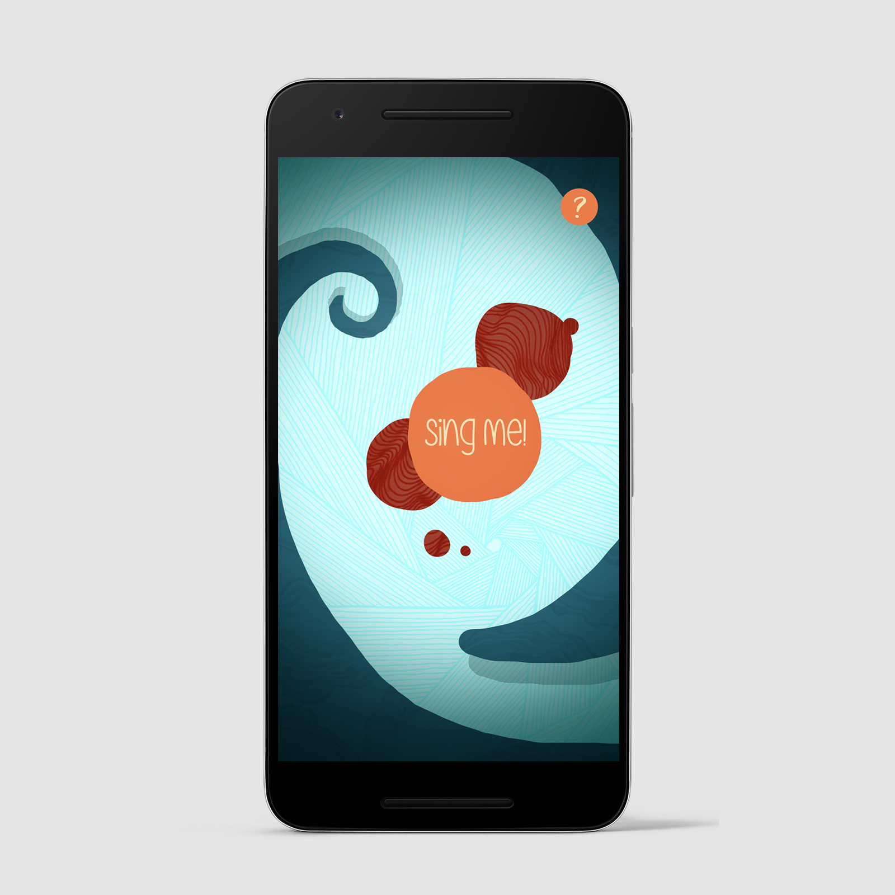
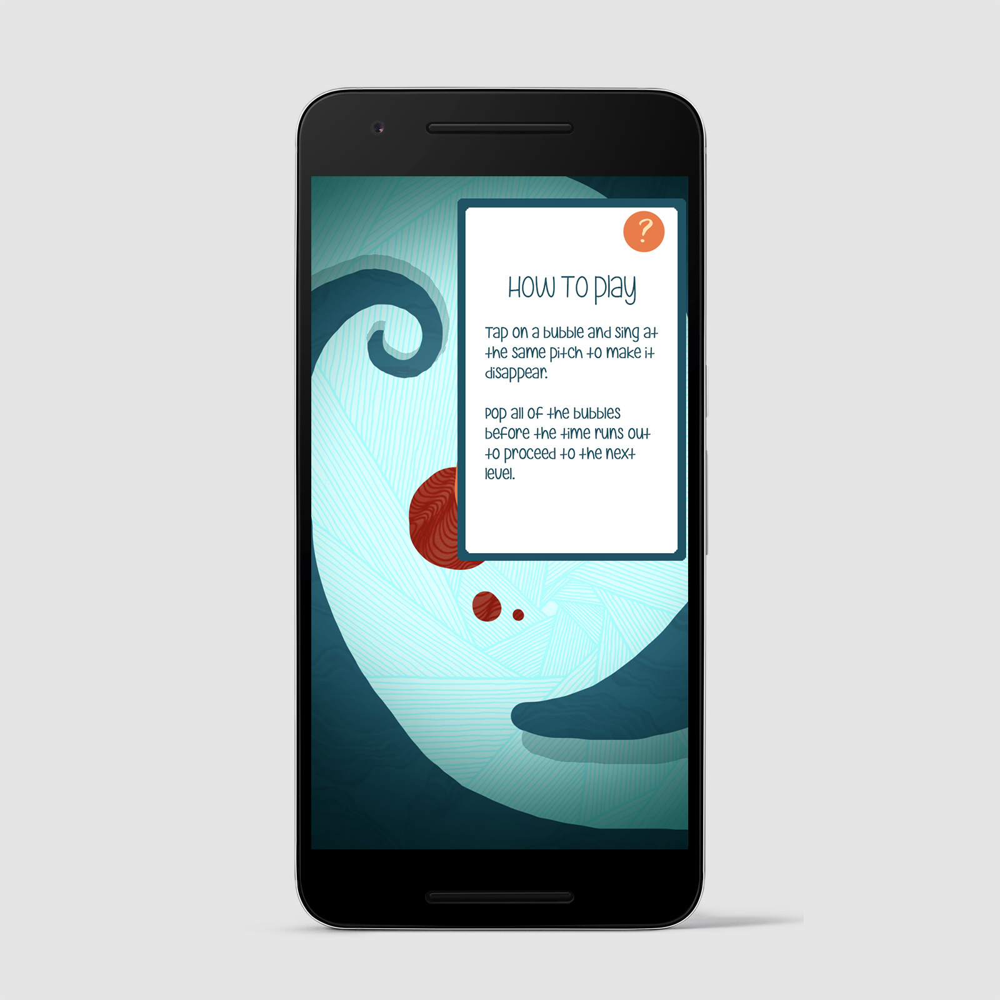
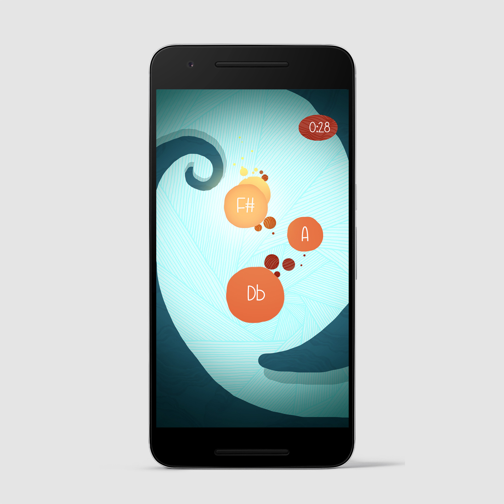

# SingMe

SingMe is a vocal pitch matching game for Android. My goal with this application is to create a fun, interactive environment where people
can put their pitch recognition skills to the test. The user is given a number of notes to sing and a time limit to sing them in. If they 
sing all of the notes within that time limit, they pass to a progressively more difficult level.

*This application is still in development, and any suggestions to make the program more efficient would be incredibly welcome :)*
Contact: Jonny McGregor - jonny.mcgregor1@gmail.com
